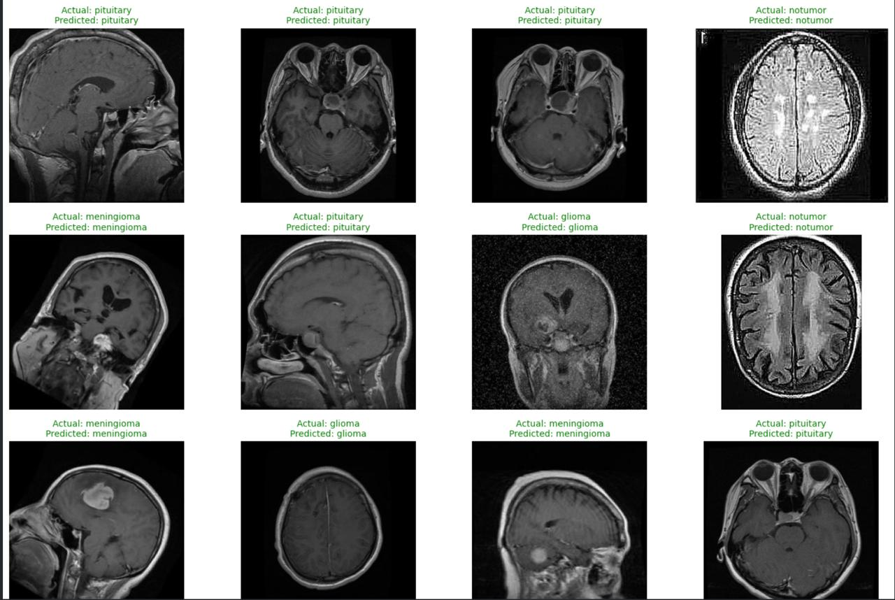

<h1 align="center">Brain MRI Tumor Classification Using CNN and VGG16 Transfer Learning</h1>

<p align="center">
  A comparative deep learning study evaluating a custom <b>Convolutional Neural Network (CNN)</b>
  and <b>VGG16 Transfer Learning</b> for four-class brain tumor classification from MRI images.
</p>

<p align="center">
  
</p>

---

## Table of Contents

1. [Overview](#1-overview)
2. [Dataset](#2-dataset)
3. [Methodology](#3-methodology)
4. [Results](#4-results)
5. [Model Configuration](#5-model-configuration)
6. [Key Findings](#6-key-findings)
7. [Future Work](#7-future-work)
8. [Technologies](#8-technologies)
9. [Conclusion](#9-conclusion)

---

## 1. Overview

Brain tumor classification from Magnetic Resonance Imaging (MRI) is an important application of deep learning in medical image analysis.

This project presents a comparative evaluation of two convolutional approaches for classifying brain MRI images into four categories:

- **Glioma**
- **Meningioma**
- **No Tumor**
- **Pituitary Tumor**

Two models were developed and evaluated:

| Model | Type | Description |
|---|---|---|
| **Custom CNN** | Convolutional Neural Network | Trained from scratch to establish a baseline |
| **VGG16** | Transfer Learning | ImageNet-pretrained convolutional architecture adapted for brain MRI classification |

**Objective:** determine whether transfer learning with a pretrained VGG16 architecture provides a measurable performance advantage over a CNN trained entirely from scratch.

<p align="center">
  
</p>

<p align="center">
  
</p>

<p align="center">
  
</p>

---

## 2. Dataset

The project uses a publicly available brain MRI tumor classification dataset containing images belonging to four diagnostic categories.

| Class | Description |
|---|---|
| **Glioma** | Brain tumors originating from glial cells |
| **Meningioma** | Tumors originating from the meninges |
| **No Tumor** | MRI images without an identified tumor |
| **Pituitary Tumor** | Tumors involving the pituitary gland |

All images were resized to **128 × 128 pixels** before being supplied to the models.

### Dataset Distribution

| Class | Training Images | Test Images |
|---|---:|---:|
| Glioma | 3,018 | 755 |
| Meningioma | 2,183 | 546 |
| No Tumor | 1,945 | 487 |
| Pituitary | 2,504 | 626 |
| **Total** | **9,650** | **2,414** |

> The dataset contains four classes with moderate differences in class frequency. Model performance was therefore evaluated using class-level precision, recall, and F1-score in addition to overall accuracy.

---

## 3. Methodology

The project follows a comparative experimental pipeline in which both models operate on the same four-class classification problem.

| Step | Description |
|---:|---|
| 1 | Dataset loading and organization |
| 2 | Image validation and preprocessing |
| 3 | Image resizing to 128 × 128 |
| 4 | Training and test data preparation |
| 5 | Custom CNN development |
| 6 | VGG16 transfer learning |
| 7 | Model training and validation |
| 8 | Test-set prediction |
| 9 | Classification report generation |
| 10 | Confusion matrix and performance analysis |

### Experimental Pipeline

```text
Brain MRI Dataset
        │
        ▼
Image Preprocessing
        │
        ├───────────────┐
        ▼               ▼
   Custom CNN        VGG16
        │           Transfer Learning
        │               │
        ▼               ▼
   Classification   Classification
        │               │
        └───────┬───────┘
                ▼
        Test Set Evaluation
                │
                ▼
   Accuracy / Precision / Recall
            / F1-Score
                │
                ▼
        Model Comparison
