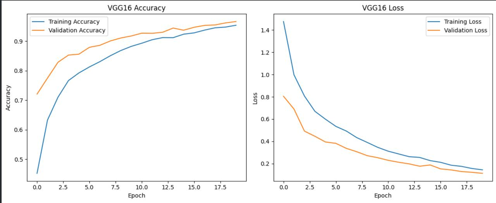

<h1 align="center">Brain MRI Tumor Classification Using CNN and VGG16 Transfer Learning</h1>

<p align="center">
  A comparative deep learning study evaluating a custom <b>Convolutional Neural Network (CNN)</b>
  against <b>VGG16 Transfer Learning</b> for four-class brain tumor classification from MRI scans.
</p>

<p align="center">
  
</p>

---

## Table of Contents
1. [Overview](#1-overview)
2. [Dataset](#2-dataset)
3. [Methodology](#3-methodology)
4. [Results](#4-results)
5. [Model Configuration](#5-model-configuration)
6. [Key Findings](#6-key-findings)
7. [Future Work](#7-future-work)
8. [Technologies](#8-technologies)
9. [Conclusion](#9-conclusion)

---

## 1. Overview

Brain tumor classification from Magnetic Resonance Imaging (MRI) is a critical application of deep learning in medical image analysis, with direct implications for diagnostic efficiency and clinical decision support. This project benchmarks two deep learning approaches for classifying brain MRI scans into four categories:

- **Glioma**
- **Meningioma**
- **No Tumor**
- **Pituitary Tumor**

| Model | Type | Description |
|---|---|---|
| **Custom CNN** | Convolutional Neural Network | Trained from scratch as the baseline architecture |
| **VGG16** | Transfer Learning | ImageNet-pretrained CNN fine-tuned for MRI classification |

**Objective:** Determine whether transfer learning yields superior classification performance compared to a CNN trained entirely from scratch.

---

## 2. Dataset

The project uses a publicly available brain MRI tumor classification dataset spanning four diagnostic categories.

| Class | Training Images | Test Images |
|---|---:|---:|
| Glioma | 3,018 | 755 |
| Meningioma | 2,183 | 546 |
| No Tumor | 1,945 | 487 |
| Pituitary | 2,504 | 626 |
| **Total** | **9,650** | **2,414** |

All images were resized to **128 × 128 pixels** to standardize input dimensions across both architectures.

---

## 3. Methodology

Both architectures were trained and evaluated on an identical dataset split to ensure a fair, controlled comparison.

```text
                Brain MRI Dataset
                       │
                       ▼
              Image Preprocessing
                 128 × 128
                       │
             ┌─────────┴─────────┐
             ▼                   ▼
        Custom CNN            VGG16
     Trained from Scratch   Transfer Learning
             │                   │
             ▼                   ▼
        Predictions         Predictions
             │                   │
             └─────────┬─────────┘
                        ▼
                Model Evaluation
                        │
                        ▼
          Accuracy / Precision / Recall
                    / F1-Score
```

**Custom CNN**
The baseline CNN learns discriminative image features directly from the training data through stacked convolutional and pooling layers, followed by fully connected classification layers.

**VGG16 Transfer Learning**
VGG16 leverages convolutional features pretrained on ImageNet, with the classification head fine-tuned to distinguish the four brain tumor categories — enabling the model to build on generalized visual representations rather than learning from scratch.

---

## 4. Results

### Overall Performance

| Model | Approach | Test Accuracy |
|---|---|---:|
| Custom CNN | Trained from scratch | 76.44% |
| **VGG16** | **Transfer Learning** | **93.56%** |

VGG16 improved test accuracy by **17.12 percentage points** over the custom CNN baseline.

### VGG16 Training Curves
<p align="center">
  
</p>
<p align="center">
  
</p>

### VGG16 Confusion Matrix
<p align="center">
  
</p>

### VGG16 Classification Report
<p align="center">
  
</p>

The VGG16 model demonstrated markedly stronger classification performance across all four tumor categories relative to the CNN baseline.

---

## 5. Model Configuration

| Parameter | Value |
|---|---|
| Image Size | 128 × 128 |
| Number of Classes | 4 |
| Optimizer | Adam |
| Architecture 1 | Custom CNN |
| Architecture 2 | VGG16 |
| VGG16 Pretraining | ImageNet |
| Evaluation | Held-out test set |
| Metrics | Accuracy, Precision, Recall, F1-Score |

---

## 6. Key Findings

| # | Finding |
|---|---|
| 1 | VGG16 significantly outperformed the custom CNN across all evaluation metrics. |
| 2 | Transfer learning improved accuracy from 76.44% to 93.56%. |
| 3 | Pretrained visual representations provided a stronger initialization for MRI feature extraction than learning from scratch. |
| 4 | Class-level evaluation confirmed consistent performance gains beyond aggregate accuracy alone. |

---

## 7. Future Work

- Evaluate additional pretrained architectures — ResNet, EfficientNet, DenseNet, and ConvNeXt
- Experiment with higher-resolution MRI inputs to preserve finer diagnostic detail
- Apply Grad-CAM for model explainability and clinical interpretability
- Incorporate data augmentation and class-balancing techniques
- Validate model performance on an independent, externally sourced dataset

---

## 8. Technologies

| Category | Tools |
|---|---|
| Language | Python |
| Deep Learning | TensorFlow / Keras |
| Architectures | CNN, VGG16 |
| Data Processing | NumPy, Pandas |
| Evaluation | Scikit-learn |
| Visualization | Matplotlib |
| Environment | Jupyter Notebook / Google Colab |

---

## 9. Conclusion

This study demonstrates the effectiveness of transfer learning for brain MRI tumor classification. The VGG16 model achieved **93.56%** test accuracy, substantially outperforming the **76.44%** achieved by the custom CNN trained from scratch.

These results confirm that pretrained convolutional representations offer a measurable advantage when developing deep learning models for medical image classification tasks constrained by limited domain-specific data.

> **Disclaimer:** This project is intended for research and educational purposes only. Model predictions should not be interpreted as a medical diagnosis or substitute for professional clinical evaluation.
